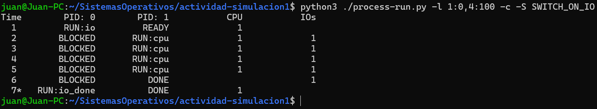
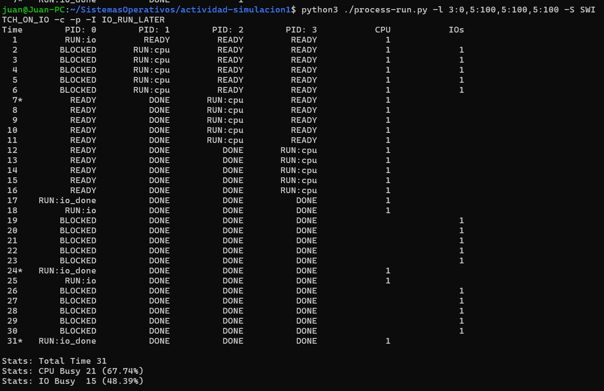
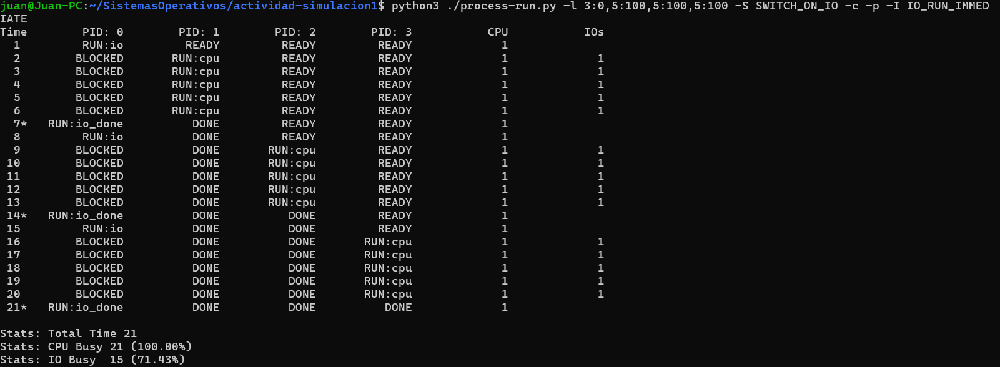
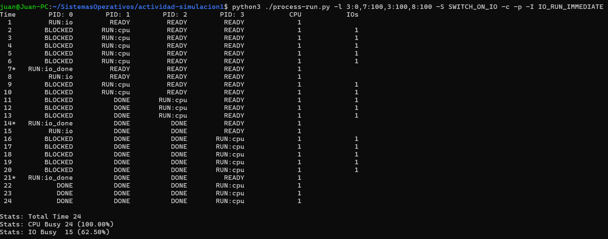

# Actividad de seguimiento - Simulación 1

|Integrante|correo|usuario github|
|---|---|---|
|Juan Pablo Gómez López|juan.gomez148@udea.edu.co|jgomelop|
|Danilo Antonio Tovar Arias|danilo.tovar@udea.edu.co|DaniloTovar|

## Instrucciones

Antes de empezar a realizar esta actividad haga un **fork** de este repositorio y sobre este trabaje en la solución de las preguntas planteadas en la actividad de simulación. Las respuestas deben ser respondidas en español o si lo prefiere en ingles en el lugar señalado para ello (La palabra **answer** muestra donde).

**Importante**:
* Como la actividad es en las parejas del laboratorio, solo uno de los integrantes tiene que hacer el fork; y sobre repositorio bifurcado que se genera, la modificación se realiza en equipo.
* Como la entrega se debe hacer modificando el archivo READNE, se recomienda que consulte mas sobre el lenguaje **Markdown**. En el repo adjuntan dos cheatsheet ([cheat sheet 1](Markdown_Cheat_Sheet.pdf), [cheatsheet 2](markdown-cheatsheet.pdf)) para consulta rapida.
* Entre mas creativo mejor.

## Homework (Simulation)

This program, [`process-run.py`](process-run.py), allows you to see how process states change as programs run and either use the CPU (e.g., perform an add instruction) or do I/O (e.g., send a request to a disk and wait for it to complete). See the [README](https://github.com/remzi-arpacidusseau/ostep-homework/blob/master/cpu-intro/README.md) for details.

### Questions

1. Run `process-run.py` with the following flags: `-l 5:100,5:100`. What should the CPU utilization be (e.g., the percent of time the CPU is in use?) Why do you know this? Use the `-c` and `-p` flags to see if you were right.
   
   

   
Answer

      
   
      
   De acuerdo a las imagen resultante anterior se concluye que la CPU debería estar en uso el 100% del tiempo, tal que el 50% del tiempo se ocupa en el proceso 1 y el otro 50% en el proceso 2. Debido a que no existe ningun proceso de entrada y/o salida para ninguno de los 2 procesos. Lo anterior se verifica con la siguiente imagen:
   
   
   
   

    

2. Now run with these flags: `./process-run.py -l 4:100,1:0`. These flags specify one process with 4 instructions (all to use the CPU), and one that simply issues an I/O and waits for it to be done. How long does it take to complete both processes? Use `-c` and `-p` to find out if you were right. 
   
   

   
Answer

      
   
      
   De acuerdo al resultado obtenido, se utilizan 4 momentos necesarios para completar las 4 instrucciones establecidas por el proceso 1, mientras que para el proceso de I/O será necesario un momento para iniciar la actividad de I/O y adicionalmente, se utilizara el tiempo necesario para completar la actividad de I/O. Como se puede observar en la siguiente imagen:
   
   
   
   

    

3. Switch the order of the processes: `-l 1:0,4:100`. What happens now? Does switching the order matter? Why? (As always, use `-c` and `-p` to see if you were right)
   
   

   
Answer

      
   
   
   A diferencia del punto anterior, ahora primero se inicia el proceso de I/O primero, permitiendo que se aproveche de manera mas optima los tiempos, debido a que se utiliza un momento de la CPU para iniciar la actividad de I/O, y mientras se completa esa actividad la CPU se utiliza en los 4 momentos necesarios para completar las 4 instrucciones establecidas por el otro proceso, reduciendo el tiempo total necesario para completar ambos proceso. Como se observa en la siguiente imagen:
   
   
   
   

    

4. We'll now explore some of the other flags. One important flag is `-S`, which determines how the system reacts when a process issues an I/O. With the flag set to SWITCH ON END, the system will NOT switch to another process while one is doing I/O, instead waiting until the process is completely finished. What happens when you run the following two processes (`-l 1:0,4:100 -c -S SWITCH ON END`), one doing I/O and the other doing CPU work?
   
   

   
Answer
   
      
   En este caso, a pesar de que la actividad de I/O se inicia primero, debido al nuevo flag, se debe esperar a que finalice dicha actividad antes de iniciar el otro proceso. Como se muestra en la imagen:
      
   
   
   

    

5. Now, run the same processes, but with the switching behavior set to switch to another process whenever one is WAITING for I/O (`-l 1:0,4:100 -c -S SWITCH ON IO`). What happens now? Use `-c` and `-p` to confirm that you are right.
   
   

   
Answer

   Cuando se hace la llamada a I/O, el proceso entra en estado BLOCKED, e <em>inmediatamente comienza a ejecutarse el otro proceso</em> PID: 1, que estaba READY. Es importante anotar que en este caso el proceso PID: 1 termina antes de que la llamada I/O se complete, por lo que este último proceso permanece en estado BLOCKED un tiempo más, hasta que finaliza.

   
   

    

6. One other important behavior is what to do when an I/O completes. With `-I IO RUN LATER`, when an I/O completes, the process that issued it is not necessarily run right away; rather, whatever was running at the time keeps running. What happens when you run this combination of processes? (`./process-run.py -l 3:0,5:100,5:100,5:100 -S SWITCH ON IO -c -p -I IO RUN LATER`) Are system resources being effectively utilized?
   
   

   
Answer

   Primero hace una llamada I/O, bloqueando ese proceso, luego cambia al siguiente proceso de CPU, pero cuando termina el llamado a I/O, no se regresa, y continua ejecutando los demás procesos de CPU, dejando 10 tiempos al recurso de I/O en espera. Este no es un uso eficiente de los recursos.

   

   

    

7. Now run the same processes, but with `-I IO RUN IMMEDIATE` set, which immediately runs the process that issued the I/O. How does this behavior differ? Why might running a process that just completed an I/O again be a good idea?
   
   

   
Answer

   En comparación con el caso anterior, al finalizar una llamada de I/O se comienza a ejecutar la siguiente llamada de I/O y no se espera a que terminen los demás procesos de CPU primero. Se observa la reducción en 10 tiempos, mejorando la eficiencia. Por lo tanto, es buena idea regresar a la siguiente llamada de I/O luego de terminar una llamada de I/O debido a que este tipo de llamadas entran en estado BLOCKED, y permiten ejecutar procesos de CPU mientras tanto.

   

   A continuación se muestra el mismo caso, pero con valores distintos para las llamadas en CPU. Se puede observar cómo se interrumpe un proceso de CPU para comenzar una llamada de I/O y luego regresar al proceso en ejecución.

   
   

    

### Criterios de evaluación
- [x] Despligue de los resultados y analisis claro de los resultados respecto a lo visto en la teoria.
- [x] Creatividad y orden.
